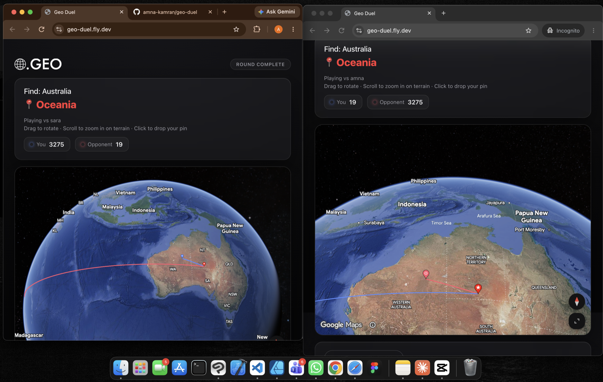

# Geo Duel

A real-time 2-player geography guessing game. Both players are shown a place name, drop a pin on a photorealistic 3D globe to guess where it is, and score points based on how close their guess lands.

**Play it live:** [geo-duel.fly.dev](https://geo-duel.fly.dev)



## How it works

- Pick a name and you're matched with the next player looking for a game. If no one's around within 8 seconds, you'll play against **GeoBot**, an AI opponent that plays with deliberately imperfect accuracy scaled to your own historical average.
- Each round shows a place to find. Drag to rotate the globe, scroll to zoom, and click to drop your guess.
- Once both players guess, the actual location is revealed along with both guesses, the distance-based score for each, and the continent name.
- Scores persist to a global leaderboard, ranked by total score across all games.

## Stack

- **Backend:** Go, using [Gorilla WebSocket](https://github.com/gorilla/websocket) for real-time pairing and gameplay, with a JSON-file-backed leaderboard.
- **Frontend:** Vanilla JS + the Google Maps JavaScript API's Photorealistic 3D Maps (`Map3DElement`) for the globe.
- **Deploy:** Docker, running on [Fly.io](https://fly.io).

## Running locally

```bash
go run .
```

Then open `http://localhost:8080`. The server listens on port 8080 and serves the frontend directly from `web/`.

## Project layout

```
main.go                  entry point, HTTP + WebSocket routing
internal/game/
  hub.go                  WebSocket connection handling and player pairing
  bot.go                  GeoBot AI opponent
  scoring.go              haversine distance + score curve
  leaderboard.go          persistent leaderboard storage
  locations.go            place data
web/
  index.html, app.js, style.css   frontend + 3D globe integration
```
